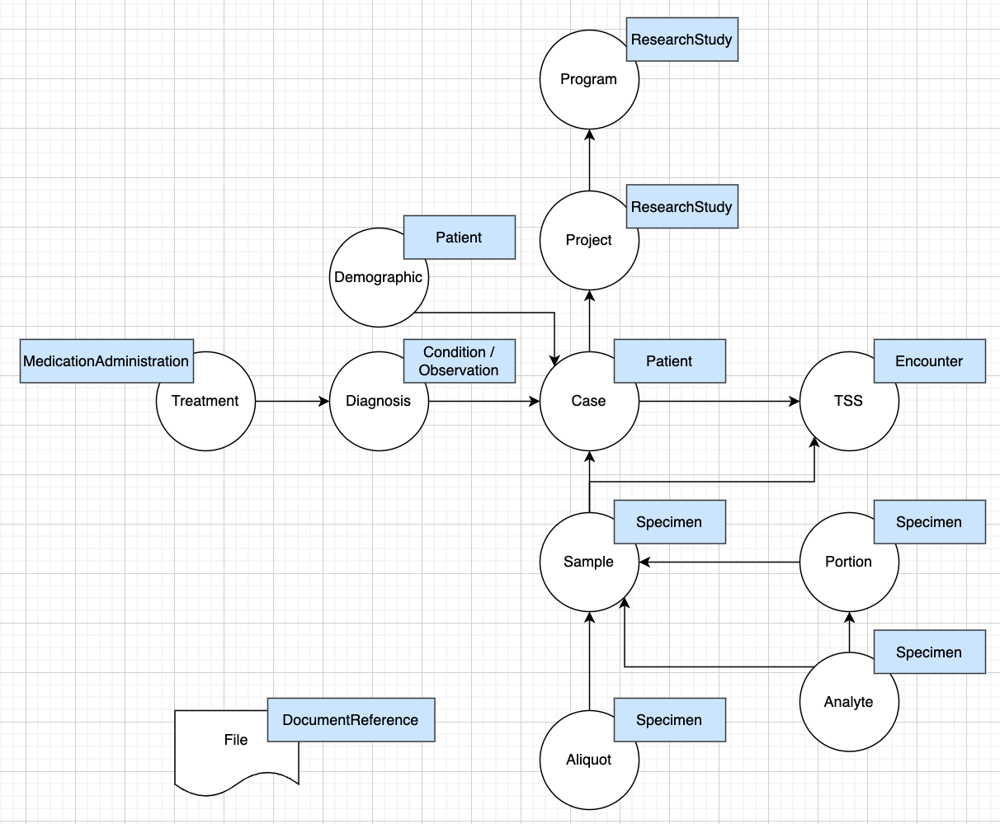

# gdc2fhir


## Project overview: 
Mapping GDC (Genomic Data Commons) schema to Ellrot's lab FHIR (Fast Healthcare Interoperability Resources) schema.

### High-level mapping:


### gdc2fhir structure:

Data directories:
- **mapping**: json data maps done by gdc2fhir
- **resources**: data resources generated or used in mappings

****
```
gdc2fhir/
|-- gdc2fhir/
|   |-- __init__.py
|   |-- schema.py
|   |-- mapping.py
|   |-- utils.py
|   └── cli.py
|   
|-- mapping/
|   |-- project.json
|   |-- case.json
|   └── file.json
|  
|-- resources/
|   |-- gdc_resources/
|   |   |-- content_annotations/
|   |   |-- data_dictionary/
|   |   └── fields/
|   └── fhir_resources/
| 
|-- tests/
|   |-- __init__.py
|   |-- unit/
|   |-- __init__.py
|   └── test_mapping.py
|   |-- integration/
|   |-- __init__.py
|   └── test_schema.py
|   
|--README.md
└── setup.py
```

## Installation

- from source 
```
git clone repo
cd gdc2fhir
python setup.py install
```

### Testing 
```
pytest --cov
```

### click cmds

initialize initial structure of project, case, or file to add Maps

```
gdc2fhir project_init 
gdc2fhir case_init 
gdc2fhir file_init 
```

convert GDC keys to FHIR 
```
gdc2fhir convert --in_path '../../my_gdc_data.json' --out_path '../../my_mapping_result.json' --verbose 'True' 
```