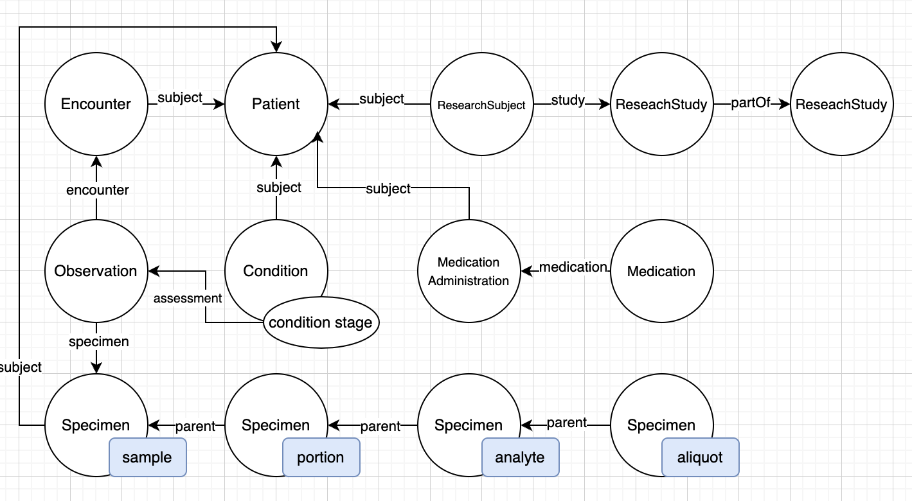

# fhirizer


## Project overview: 
Mapping GDC (Genomic Data Commons) schema or Cellosaurus cell-lines to FHIR (Fast Healthcare Interoperability Resources) schema.

### High-level mapping:
- #### GDC schema 


- #### FHIR simplified schema 



### fhirizer structure:

Data directories:
- **mapping**: json data maps produced by fhirizer pydantic schema maps
- **resources**: data resources generated or used in mappings

****
```
fhirizer/
|-- fhirizer/
|   |-- __init__.py
|   |-- labels/
|   |   |-- __init__.py
|   |   |-- files.py
|   |   |-- case.py
|   |   └── project.py
|   |   
|   |-- schema.py
|   |-- entity2fhir.py
|   |-- mapping.py
|   |-- utils.py
|   └── cli.py
|   
|-- mapping/
|   |-- project.json
|   |-- case.json
|   └── file.json
|  
|-- resources/
|   |-- gdc_resources/
|   |   |-- content_annotations/
|   |   |-- data_dictionary/
|   |   └── fields/
|   └── fhir_resources/
| 
|-- tests/
|   |-- __init__.py
|   |-- unit/
|   |   |-- __init__.py
|   |   └── test_mapping.py
|   |-- integration/
|   |   |-- __init__.py
|   |   └── test_schema.py
|   └── fixtures/
|   
|--README.md
└── setup.py
```

## Installation

- from source 
```
git clone repo
cd fhirizer
# create virtual env ex. 
python -m venv venv-fhirizer
source venv-fhirizer/bin/activate
pip install . 
```

- Dockerfile

```
(sudo) docker build -t <tag-name>:latest .
(sudo) docker run -it --rm <tag-name>:latest
```

- Singularity 
```
singularity build --remote fhirizer.sif fhirizer.def
singularity shell --bind <local_path_to_resources>/fhirizer/resources:/usr/local/lib/python<version>/dist-packages/resources fhirizer.sif
```

### Convert and Generate
 
- convert GDC schema keys to fhir mapping
- generate fhir object models ndjson files in directory

  Example run for patient - replace path's to ndjson files or directories. 
 
```
fhirizer convert --name case --in_path cases.ndjson --out_path cases_key.ndjson --verbose True

fhirizer generate --name case --out_dir ./data --entity_path cases_key.ndjson

``` 

- to generate document reference for the patients 

 
```
fhirizer convert --name file --in_path files.ndjson --out_path files_key.ndjson --verbose True

fhirizer generate --name file --out_dir ./data --entity_path files_key.ndjson

``` 

### click cmds for constructing maps

initialize initial structure of project, case, or file to add Maps

```
fhirizer project_init 
fhirizer case_init 
fhirizer file_init 
# run ex. ./labels/project.py 
```


### Testing 
```
pytest -cov 
```
